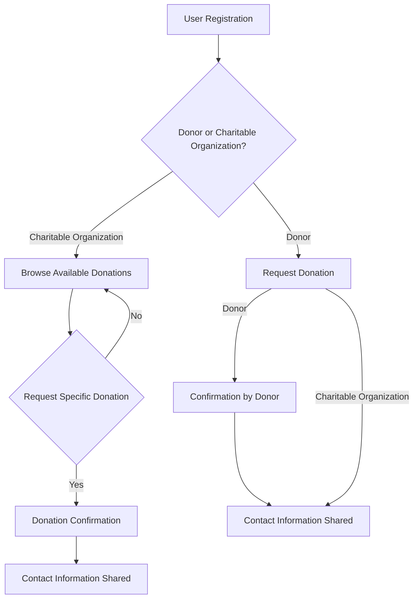

# Hackathon Code-A-Haunt
Problem statement number - CBP27 
Problem title - Student Innovation

__Food Donation Website__

Overview

This repository contains the source code for a food donation website aimed at facilitating the donation process for individuals willing to contribute to charity organizations. The website allows users to donate money, which will be used to purchase food items for those in need. Additionally, the website facilitates direct donations of food items. Upon receiving donations, we will coordinate with nearby charity organizations to distribute the donated food or utilize the donated money for purchasing food items.

How It Works
The workflow of the food donation website can be summarized in the following steps:

User Registration/Login: Users can register or log in to the website using their credentials.

Donation Selection: Once logged in, users have the option to choose between donating money or food items.

Money Donation: Users can specify the amount they wish to donate. Upon completion of the donation process, they receive an acknowledgment and an e-certificate.

Food Donation: Users can specify the type and quantity of food items they wish to donate. They can either drop off the items at a designated location or opt for pick-up services.

Coordination with Charity Organizations: Upon receiving donations, the website admin coordinates with nearby charity organizations. For money donations, the funds are allocated to purchase food items.

Distribution of Donations: The charity organizations distribute the donated food items to those in need or utilize the donated money for purchasing food items.

Acknowledgment and E-Certificate: Users receive an acknowledgment for their donations along with an e-certificate for their contribution.

