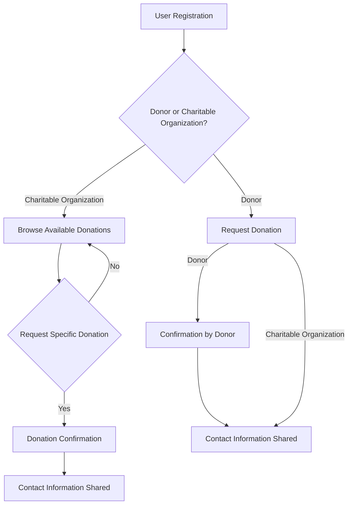

# Hackathon Code-A-Haunt
Problem statement number - CBP27 
Problem title - Student Innovation

```mermaid
graph TD;
    A[User Registration] --> B{Donor or Charitable Organization?};
    B --> |Donor| D[Request Donation];
    B --> |Charitable Organization| H[Browse Available Donations];
    H --> I{Request Specific Donation};
    I --> |Yes| J[Donation Confirmation];
    J --> K[Contact Information Shared];
    I --> |No| H;
    D --> |Donor| F[Confirmation by Donor];
    F --> G[Contact Information Shared];
    D --> |Charitable Organization| G[Contact Information Shared];


```

